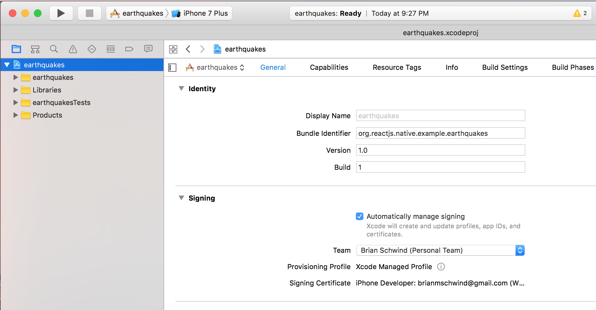

# Earthquakes

An app to display recent earthquake information on a map, implemented with Re-Natal, a react-native wrapper for ClojureScript.

Initialize Project
------------------

```
re-natal init earthquakes -i reagent6
cd earthquakes
```

Install App on iOS Device
-------------------------

In XCode, navigate to the project's general settings tab:

* `open ios/earthquakes.xcodeproj/`
* Click on the blue project icon in the file explorer
* Select your "team" for code signing



* Press the Play button to run on your device/simulator

Install App on Android Device
-----------------------------

```
react-native run-android
```

Run
---

```
adb reverse tcp:8081 tcp:8081
adb reverse tcp:3449 tcp:3449
re-natal use-ios-device real
re-natal use-android-device real
re-natal use-figwheel
react-native start --nonPersistent & # Run react-native packager in the background
rlwrap lein figwheel ios android
```
